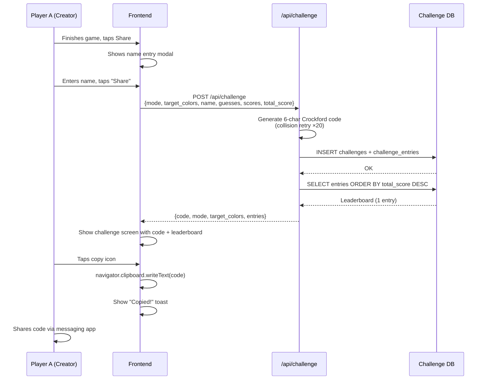
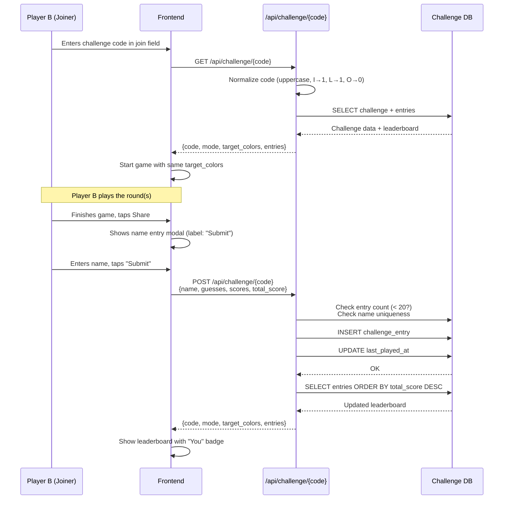
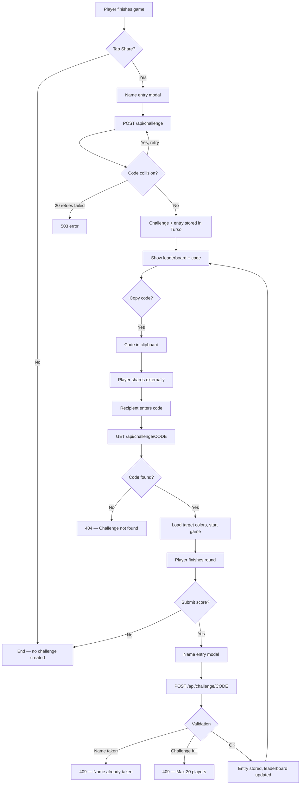

# Challenge Sharing Design

## Environment Matrix

| Environment | DB Backend | Persistence | Challenge Data |
|---|---|---|---|
| **Local** (`make dev`) | SQLite `data/challenges.db` | Permanent (file on disk) | Survives restarts |
| **Vercel Preview** | SQLite `/tmp/challenges.db` | Ephemeral (~10 min idle) | Lost on cold start or redeploy |
| **Vercel Prod (no Turso)** | SQLite `/tmp/challenges.db` | Ephemeral | **Same as preview — broken** |
| **Vercel Prod (Turso)** | Turso HTTP API | Permanent (multi-region) | Survives everything |

## Why Turso

Turso (LibSQL) over Supabase (Postgres) for challenge storage:

- **Zero deps.** HTTP pipeline API via stdlib `urllib` — no SDK. The entire client is one 47-line function.
- **SQLite parity.** Local dev uses SQLite. Turso is a SQLite fork — same dialect, same schema, no translation layer.
- **Serverless-native.** Stateless HTTP request per pipeline. No connection pooling, no persistent TCP. Fits Vercel cold-start model.

### Data classification

All challenge data is **non-PII, non-sensitive:**

- **Display names** — free-text, no uniqueness across challenges, no link to real identity. Equivalent to a whiteboard initial.
- **Scores / guesses** — game telemetry only. Color HSB values and CIEDE2000 floats.
- **Challenge codes** — random, unguessable but not secret. No auth tokens, no sessions.
- **No IP logging, no cookies, no device fingerprints.** Server stores only what the client explicitly submits.

This classification is what makes the current architecture viable — no encryption-at-rest requirements, no GDPR data-subject requests, no access-control model. If accounts ship and names become linkable to real identities, the classification changes and the infrastructure obligations change with it (see forcing functions below).

### Forcing functions toward something heavier

Turso stops being the right answer if any of these ship:

| Feature | Why it forces the question |
|---|---|
| **User accounts / auth** | Supabase auth is batteries-included. Rolling auth on Turso means building session management, password hashing, OAuth flows from scratch. |
| **Global leaderboard** | Cross-challenge aggregation, filtering by mode, pagination, ranking — Postgres query planner handles this naturally. SQLite dialect gets awkward at scale. |
| **Real-time leaderboard** | Supabase Realtime (Postgres LISTEN/NOTIFY) gives live updates. Turso has no pub/sub — you'd poll. |
| **Row-level security** | If user data needs per-user access control, Postgres RLS is declarative. Turso has no equivalent. |

None of these are on the immediate roadmap. Server-side scoring and daily challenges (both planned) work fine on Turso. Re-evaluate when accounts or global leaderboards move to "committed."

## Data Isolation Analysis

### Cross-Environment Isolation

No isolation issues — environments are fully isolated by design:
- Local uses `data/challenges.db` (never touches Vercel)
- Each Vercel deployment gets its own `/tmp` (no cross-deployment leakage)
- Turso credentials are environment-scoped (only prod has them, or should)

### Within-Environment Isolation

**No auth = no player isolation.** This is by design (casual game), but has consequences:

1. **Name squatting** — Anyone can claim any name on a challenge. No way to prove identity.
2. **Score spoofing** — `total_score` is client-submitted, server trusts it. A player can POST any score.
3. **Leaderboard pollution** — 20-entry cap is the only protection. A bad actor fills it with junk names.

### Preview ↔ Prod Data Bleed

**No bleed possible.** Preview and prod are separate Vercel deployments with separate `/tmp` filesystems and (if configured) separate Turso databases. Challenge codes created on a preview deployment won't resolve on prod, and vice versa. This is correct behavior.

**Risk:** A user shares a preview URL with a challenge code. Recipient visits prod URL with same code → 404. Low risk (codes are manually copied, not embedded in URLs yet).

---

## User Journey: Create & Share Challenge



## User Journey: Join Challenge



## User Journey: Challenge Code Lifecycle (Prod with Turso)



---

## Prod Edge Cases

### 1. Turso Not Configured on Prod

**Severity: Critical**

If `TURSO_DATABASE_URL` and `TURSO_AUTH_TOKEN` are not set, prod falls back to `/tmp/challenges.db`. Challenge codes work within a single warm instance but:
- Cold start = all challenges gone
- Different instances (concurrent requests) = different `/tmp` = different databases
- Player A creates challenge on instance 1, Player B resolves on instance 2 → 404

**Check:** Verify Turso env vars are set in Vercel prod environment.

### 2. Serverless Instance Isolation (Without Turso)

**Severity: Critical (if Turso is missing)**

Vercel spins multiple serverless instances. Each has its own `/tmp`. Without Turso:
- Two concurrent requests may hit different instances
- Challenge created on instance A is invisible to instance B
- This is not eventual consistency — the data literally doesn't exist

**Mitigation:** Turso is the fix. The SQLite fallback is only viable for local dev.

### 3. Score Spoofing

**Severity: Medium**

`total_score` is client-submitted with no server validation. A user can:
```bash
curl -X POST https://splash-of-hue.vercel.app/api/challenge/ABC123 \
  -H 'Content-Type: application/json' \
  -d '{"name":"cheater","guesses":[{"h":0,"s":0,"b":0}],"scores":[100],"total_score":99999}'
```

The server stores it verbatim. Leaderboard is corrupted.

**Mitigation options:**
- Server-side CIEDE2000 validation (re-compute from guesses + target_colors)
- Plausibility check (total_score can't exceed theoretical max per mode)
- For now: acceptable for a casual game, but document the risk

### 4. Name Collision Across Challenges

**Not a problem.** `UNIQUE(code, name)` scopes names per challenge. Same person can be "Alice" on many challenges.

### 5. Challenge Code Exhaustion

**Severity: Negligible.** 32^6 ≈ 1.07 billion codes. Even at 1M challenges, collision probability per generation is ~0.1%. The retry loop (×20) handles it.

### 6. Race Condition: Two Players Submit Same Name Simultaneously

**Severity: Low.**

Two players both check name availability, both pass, both try to INSERT:
- **SQLite:** Second INSERT fails on UNIQUE constraint → unhandled exception → 500
- **Turso:** Same — UNIQUE constraint violation

**Fix:** Wrap the name-check + INSERT in a transaction, or catch the IntegrityError and return 409.

Currently the code does:
```python
existing = _challenge_execute("SELECT 1 ... WHERE code = ? AND name = ?", ...)
if existing["rows"]:
    raise HTTPException(409, "Name already taken")
# ... later ...
_challenge_execute("INSERT INTO challenge_entries ...")
```

This is a TOCTOU (time-of-check-time-of-use) race. The window is small but real.

### 7. Entry ID Collision

**Severity: Very Low.**

`entry_id = str(uuid.uuid4())[:8]` — 8 hex chars = 4 billion possibilities. No uniqueness check on insert. A collision would cause a primary key violation → 500 error. Astronomically unlikely but the error is unhandled.

### 8. XSS via Player Name

**Severity: Low (mitigated).**

Frontend uses `escapeHtml()` when rendering names. Server stores raw strings. This is fine as long as every render path escapes. Verify no `innerHTML = name` without escaping exists.

### 9. `/tmp` Cleanup Timing on Vercel

**Severity: Info.**

Vercel doesn't guarantee `/tmp` survives between invocations of the same instance. In practice, warm instances keep `/tmp` for ~5-10 minutes. But this is undocumented behavior. Don't rely on it for anything user-facing — which is why Turso exists.

### 10. No Rate Limiting

**Severity: Medium.**

No rate limiting on challenge creation or entry submission. A script could:
- Create millions of challenges (fills Turso storage)
- Fill any challenge's 20 slots instantly

**Mitigation:** The 20-entry cap limits per-challenge damage. Turso has storage limits. But there's no IP-based or token-based throttling.

---

## Summary of Action Items

| Priority | Issue | Fix |
|---|---|---|
| **P0** | Verify Turso env vars are set on Vercel prod | Check Vercel dashboard |
| **P1** | TOCTOU race on name uniqueness check | Catch IntegrityError, return 409 |
| **P2** | Score spoofing — no server validation | Add plausibility bounds or server-side CIEDE2000 |
| **P3** | No rate limiting on challenge endpoints | Consider Vercel Edge middleware or Turso-side limits |
| **Low** | Unhandled entry_id collision | Catch PK violation or use full UUID |
| **Info** | Preview deployments have ephemeral challenges | Expected; no fix needed |
