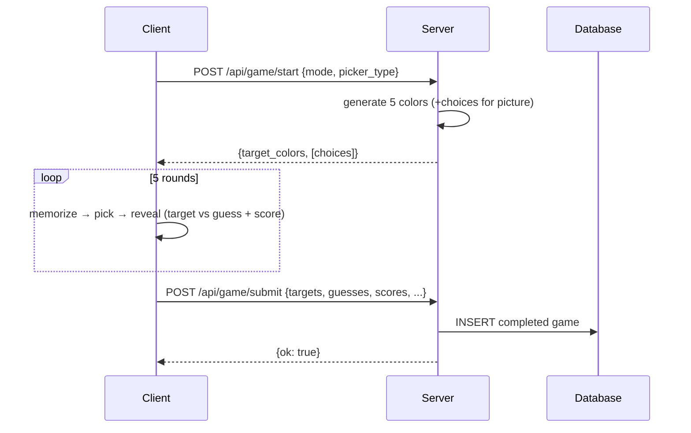
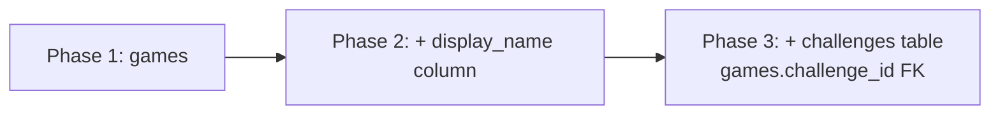

# High-Level Design

## Deployment

Vercel serverless. Python function at `api/app.py`, static files from `public/` served by Vercel CDN. Vercel's Python framework detection routes ALL requests to FastAPI (not just `/api/*`), so the function also handles `/` via redirect to the CDN-served `index.html`.

`vercel.json` rewrites:
- `/api/*` → `api/app.py` (serverless function, FastAPI catch-all)

**Note:** A catch-all SPA rewrite (`/(*)` → `/index.html`) conflicts with Vercel's framework detection and breaks API routing. Don't add one — the FastAPI `@app.get("/")` redirect handles the root URL.

## Game Flow (stateless)



Server is stateless between start and submit. Client holds target colors in memory.

## API Contracts

**POST /api/game/start**
- Request: `{ mode, picker_type }`
- Response: `{ target_colors: [{h,s,b} x5], choices?: [[{h,s,b} x4] x5] }`
- `choices` only present for `picture` mode
- No side effects — pure color generation

**POST /api/game/submit**
- Request: `{ target_colors: [{h,s,b} x5], guesses: [{h,s,b} x5], scores: [float x5], total_score: float, mode, picker_type }`
- Response: `{ ok: true }`
- Persists pre-scored results. No server-side scoring — client owns CIEDE2000 computation.
- Server-side scoring returns in Phase 3 (challenges) for competitive truth.

**GET /api/history** — removed. Personal history lives in localStorage. Endpoint returns in Phase 2 as a leaderboard.

## Database

**Now:** `/tmp/games.db` (SQLite) — ephemeral, works within warm serverless instances. History may be lost on cold starts. Acceptable because history is not a core feature yet.

**Next:** Turso (LibSQL) — persistent, SQLite-compatible, edge-distributed. Drop-in replacement when persistence matters.

**Schema (current):**

```sql
CREATE TABLE games (
    id TEXT PRIMARY KEY,
    created_at TEXT,
    mode TEXT,
    picker_type TEXT,
    target_colors TEXT,  -- JSON [{h,s,b}]
    guesses TEXT,        -- JSON [{h,s,b}]
    scores TEXT,         -- JSON [float]
    total_score REAL
);
```

**Schema evolution** (see `design-log` for rationale):



- **Phase 1 (now):** Anonymous solo games
- **Phase 2 (leaderboards):** Display name (pseudonym) submitted with score. No accounts — name stored in localStorage, freely changeable. Server stores name as a plain field on the game row, not a FK.
- **Phase 3 (multiplayer):** Shared challenges store target colors server-side, linking multiple game attempts. Display name prompted at join time. Restores server-side truth for competitive scoring while solo play stays stateless.

## Key Behaviors

- **No lifespan hooks.** Vercel doesn't fire ASGI lifespan events. DB initialization is lazy (on first write).
- **Refresh resets.** In-progress games exist only in client JS memory. Refresh returns to menu. No orphan state in DB.
- **Graceful DB failure.** If DB write fails on submit, the game already worked — client scored locally. Only history persistence is lost.
