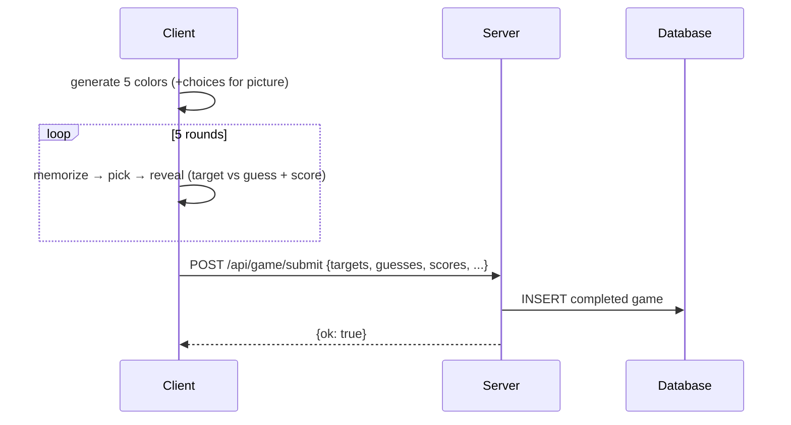

# High-Level Design

## Deployment

Vercel serverless. Python function at `api/app.py`, static files from `public/` served by Vercel CDN. Framework detection disabled (`"framework": null` in `vercel.json`) so rewrites take full control.

`vercel.json` rewrites:
- `/` → `/index.html` (CDN-served, no function invocation)
- `/api/*` → `api/app.py` (serverless function, FastAPI catch-all)

## Game Flow (client-driven)



Client generates colors and scores locally — no server round-trip to start a game. Server is append-only persistence for analytics.

## API Contracts

**POST /api/game/submit**
- Request: `{ target_colors: [{h,s,b} x5], guesses: [{h,s,b} x5], scores: [float x5], total_score: float, mode, picker_type }`
- Response: `{ ok: true }`
- Persists pre-scored results. No server-side scoring — client owns CIEDE2000 computation.
- Server-side scoring returns in Phase 3 (challenges) for competitive truth.

**POST /api/challenge** — create a challenge
- Request: `{ mode, target_colors: [{h,s,b} x5], name, guesses: [{h,s,b} x5], scores: [float x5], total_score: float }`
- Response: `{ code, mode, target_colors, entries: [{name, total_score, scores, created_at}] }`
- Generates 6-char Crockford Base32 code. Stores challenge + creator's entry atomically.

**GET /api/challenge/{code}** — fetch challenge + leaderboard
- Response: `{ code, mode, target_colors, entries: [{name, total_score, scores, created_at}] }`
- Code normalized: uppercase, I→1, L→1, O→0, dashes stripped. 404 if not found.

**POST /api/challenge/{code}** — submit score to challenge
- Request: `{ name, guesses: [{h,s,b} x5], scores: [float x5], total_score: float }`
- Response: same as GET (updated leaderboard)
- Validates: challenge exists, entry count < 20, name unique per challenge. 409 on conflict.

## Database

**Games:** `/tmp/games.db` (SQLite) — ephemeral, works within warm serverless instances. History may be lost on cold starts. Acceptable because history is not a core feature yet.

**Challenges:** Turso (LibSQL) in production via HTTP API (`TURSO_DATABASE_URL` + `TURSO_AUTH_TOKEN`). Falls back to local SQLite `data/challenges.db` when env vars absent. See `design-sharing` for edge cases.

**Schema (current):**

```sql
CREATE TABLE games (
    id TEXT PRIMARY KEY,
    created_at TEXT,
    mode TEXT,
    picker_type TEXT,
    target_colors TEXT,  -- JSON [{h,s,b}]
    guesses TEXT,        -- JSON [{h,s,b}]
    scores TEXT,         -- JSON [float]
    total_score REAL
);
```

**Challenge schema** (separate DB from games — `design-sharing`):

```sql
CREATE TABLE challenges (
    code TEXT PRIMARY KEY,        -- 6-char Crockford Base32
    mode TEXT NOT NULL,
    target_colors TEXT NOT NULL,  -- JSON [{h,s,b}]
    created_at TEXT NOT NULL,
    last_played_at TEXT NOT NULL  -- for future TTL expiration
);
CREATE TABLE challenge_entries (
    id TEXT PRIMARY KEY,
    code TEXT NOT NULL,
    name TEXT NOT NULL,           -- display name, max 20 chars
    guesses TEXT NOT NULL,
    scores TEXT NOT NULL,
    total_score REAL NOT NULL,
    created_at TEXT NOT NULL,
    UNIQUE(code, name)
);
```

## Telemetry

Client-side only, via PostHog JS SDK. No server-side analytics.

**Audit surface:** `public/analytics.js` — single file defines every event. Nothing else sends data.

**Privacy config:** `autocapture: false`, `ip: false`, `persistence: 'memory'` (no cookies/localStorage for PostHog), `disable_session_recording: true`. Each page load gets an ephemeral anonymous ID — no cross-session linking.

**Events:** `session_started`, `game_started`, `mode_transition`, `round_completed`, `game_completed`, `game_abandoned`, `picker_switched`. Full schema in `docs/specs-data-dictionary.md`.

**Dashboard:** Alpha Analytics — 10 insights covering completion funnels, hue difficulty, picker performance, speed/accuracy, abandonment, session depth, positional bias, channel weakness, mode transitions, and viewport distribution. Setup guide in `docs/pit/2026-03-29-posthog-dashboard-setup.md`.

**Failure mode:** If PostHog SDK is blocked (ad blocker, network), all calls are silent no-ops. Game functionality is unaffected.

## Key Behaviors

- **Local research tooling.** `public/calibration.html` plus the local-only `/__dev/calibration-source` and `/__dev/save-calibration-export` endpoints support scorer / `auto-grader` dogfooding only. They are not public product surfaces or stable runtime contracts.
- **No lifespan hooks.** Vercel doesn't fire ASGI lifespan events. DB initialization is lazy (on first write).
- **Refresh resets.** In-progress games exist only in client JS memory. Refresh returns to menu. No orphan state in DB.
- **Graceful DB failure.** If DB write fails on submit, the game already worked — client scored locally. Only history persistence is lost.
